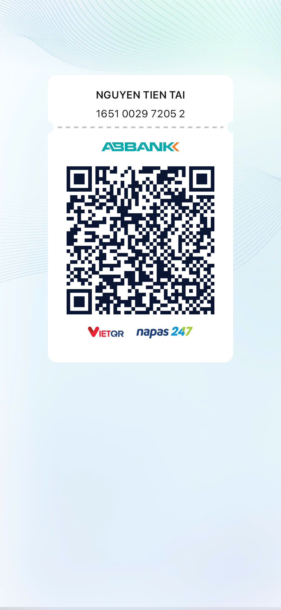

# 📦 Source Code Từ Kênh TikTok @hoclaptrinhvui

> Kho source code minh họa từ các video hướng dẫn lập trình, kỹ năng mềm… trên kênh TikTok của mình.

## 📖 Mục lục
1. Giới thiệu  
2. Hướng dẫn lấy source  
3. Dạy học online  
4. Donate ủng hộ  
5. QR Code ngân hàng  
6. Liên hệ  

---

## Giới thiệu
Mình là **[Tai Heo Dev]**, người sáng lập kênh TikTok **@hoclaptrinhvui**.  
Trên kênh mình chia sẻ:  
- Mã nguồn demo các dự án web, AI.  
- Tips & tricks lập trình (JavaScript, Python, React, NodeJs, System,...)  
- Kỹ năng mềm & hướng nghiệp IT & dạy học online. 

Toàn bộ source code đều **miễn phí**, bạn có thể tải về, nghiên cứu, tùy biến và chia sẻ lại.
Rất vui khi bạn donate giúp cho team nhiều source, đó là kinh phí giúp team thêm động lực phát triển.

---

## Hướng dẫn lấy source
Bạn có thể lấy code bằng 2 cách:

Clone trực tiếp từ GitHub:
```bash
   git clone https://github.com/fdhhhdjd/Video-Viral-Tiktok
```

## 📚 Dạy Học Online

Bên cạnh tài liệu miễn phí, mình còn mở các khóa học online:

- **Lập trình web cơ bản → nâng cao**
- **Ứng dụng về AI và Automation**
- **Kỹ năng phỏng vấn & xây CV IT**

### Thông Tin Đăng Ký

- 🌐 Website: [https://profile-forme.com](https://profile-forme.com)
- 📧 Email: nguyentientai10@gmail.com
- 📞 Zalo/Hotline: 0798805741

---

## 💖 Donate Ủng Hộ

Nếu bạn thấy các source hữu ích và muốn mình tiếp tục phát triển nội dung miễn phí, hãy ủng hộ mình bằng cách donate.  
Mình sẽ sử dụng kinh phí cho:

- 🌐 Server, domain, hosting
- 🛠️ Công cụ bản quyền (IDE, plugin…)
- 🎓 Học bổng, quà tặng cho cộng đồng

### QR Code Ngân Hàng

Quét QR để ủng hộ nhanh:




**QR Code ABBank**  
- Chủ tài khoản: Nguyễn Tiến Tài  
- Ngân hàng: NGAN HANG TMCP AN BINH  
- Số tài khoản: 1651002972052

---

## 📞 Liên Hệ

- 🎥 TikTok: [@hoclaptrinhvui](https://www.tiktok.com/@hoclaptrinhvui)
- 💻 GitHub: [fdhhhdjd](https://github.com/fdhhhdjd)
- 📧 Email: [nguyentientai10@gmail.com](mailto:nguyentientai10@gmail.com)

Cảm ơn bạn đã quan tâm & chúc bạn học tập hiệu quả! Have a nice day <3!

